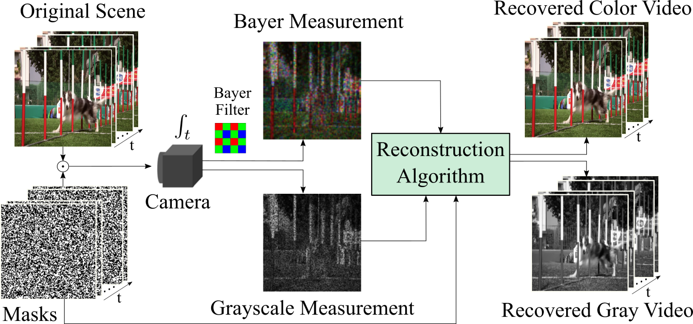

[简体中文](README_cn.md)  

# Introduction

<div align="center">
    
  
  Fig1. The Block Diagram of Video Snapshot Compressive Imaging 
</div>

Video Snapshot Compressive Imaging (Video SCI) mainly focus on capturing highspeed scenario using a low speed camera and capturing high dimensional data in a single shot in order to  minimize network transmission bandwidth, lowering time and hardware cost. These goals can be achieved by capturing 3D video data using a 2D detector and then storing and transmitting the video data into a 2D data matrix.

CACTI (Coded Aperture Compressive Temporal Imaging) is an classical Video SCI system. This library is implemented based on CACTI reconstruction algorithm via PyTorch. This library basically include all mainstream Video SCI algorithm.

CACTI Library was born in SCI Lab, Westlake University. We sincerely hope our library users can make their own contributions in various Video SCI algorithms, and by implementing and referring this library, one can broaden the library users and share deep understanding about Video SCI.

<div align="center">
    
    

  Fig2. Reconstructed Gray Value Data via Different Algorithms
</div>

<div align="center">
   
   

  Fig3. Reconstructed Colored Data via Different Algorithms
</div>

# Supported Algorithms
<div align="center">
  

  Fig3. Reconstruction Quality Comparison between Different Algorithms on Testing Dataset
</div>

## Iterative Optimization Method 
* [ADMM-TV / GAP-TV (ICIP2016)](configs/TV/README.md)  
* [DeSCI (TPAMI2019)](configs/DeSCI/README.md)

## End to End Algorithm 
* [Unet (APL Photonics 2020)](configs/Unet/README.md) 
* [BIRNAT (ECCV 2020)](configs/BIRNAT/README.md) 
* [RevSCI (CVPR2021)](configs/RevSCI/README.md) 
* [MetaSCI (CVPR2021)](configs/MetaSCI/README.md) 

## Deep Unfolding Algorithm
* [GAP-net](configs/GAP-net/README.md) 
* [DUN-3DUnet(ICCV2021)](configs/DUN-3DUnet/README.md) 
* [GAP-CCoT (Photonics Research 2022)](configs/GAP-CCoT/README_cn.md) 
* [ELP-Unfolding (ECCV 2022)](configs/ELP-Unfolding/README_cn.md) 

## Plug and Play Algorithm
* [PnP-FastDVDnet (TPAMI 2021)](configs/PnP-FastDVD/README.md) 
* [PnP-FFDNet (CVPR 2020 oral)](configs/PnP-FFDNet/README.md) 

All model parameters can be download at [Dropbox](https://www.dropbox.com/sh/3cj7nv5l0hfqup9/AAAMbLQXmoVki98cqwuv754ia?dl=0) and [BaiduNetdisk](https://pan.baidu.com/s/1wWqlXQCshwDAyaIkUkinHg) (Code: 8l92)

# CACTI Installation
Please see the [Installation Manual](docs/install.md) for CACTI Installation


# CACTI Code Library
* [CACTI Code Library Documentation](docs/introduction.md)
* [Model Training Dataset](docs/add_datasets.md)
* [Newly Added Self-Defined Model](docs/add_models.md)
* [Statistics of Model Params and FLOPs](docs/params_flops.md)
* [Images to Video and Images to GIF Transfer](docs/video_gif.md)
* [pytorch to onnx and onnx to tensorrt Tansform](docs/onnx_tensorrt.md)


# Acknowledgement
Many appreciate to all the contributors who share their work for this library. Video SCI library always open and seeking for more Video SCI algorithms.

# Citation
```
@article{2021Snapshot,
  title={Snapshot Compressive Imaging: Principle, Implementation, Theory, Algorithms and Applications},
  author={ Yuan, X.  and  Brady, D. J.  and  Katsaggelos, A. K. },
  journal={IEEE Signal Processing Magazine},
  year={2021},
}
```