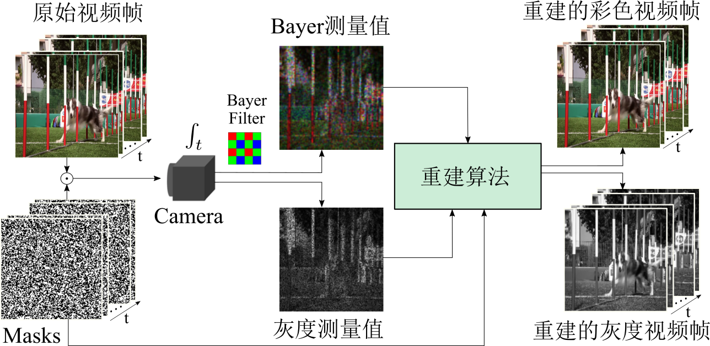
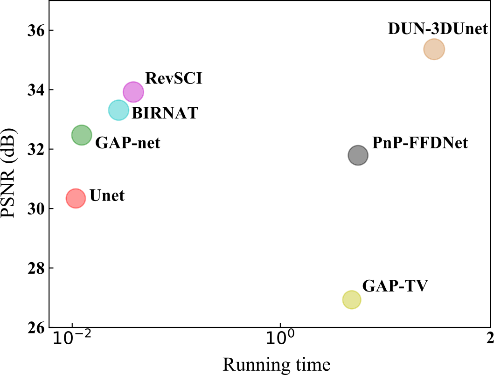

## [English](README.md) 

# 简介
<div align="center">
    
  
  图1. 视频快照压缩成像流程图 
</div>

  
视频快照压缩成像(Video SCI) 是在单个曝光时间内使用一个二维探测器捕获三维视频数据，并用一个二维数据矩阵进行存储传输，以实现低速相机捕获高速场景，单次曝光捕获高维数据，达到节省网络传输带宽，降低时间成本和硬件成本的目的。

CACTI (Coded Aperture Compressive Temporal Imaging) 是一个经典的视频快照压缩成像系统。本库是基于PyTorch的CACTI重建算法代码库，基本包含了目前主流的视频快照压缩重建算法。

CACTI代码库诞生于西湖大学袁鑫 SCI lab 实验室，我们希望通过本库能让更多的人快速了解 Video SCI，并为快速开发更多优秀的 Video SCI 重建算法提供便利。
<div align="center">
    
    
    图2. 使用不同算法重建灰度数据
</div>
 
 
<div align="center">
   
   
    图3. 使用不同算法重建彩色数据
</div>


# 已支持的算法  
<div align="center">
    

  图3. 不同重建算法在仿真数据集上的重建质量与重建时间对比 
</div>

## 迭代优化算法
* [ADMM-TV / GAP-TV (ICIP2016)](configs/TV/README_cn.md)  
* [DeSCI (TPAMI2019)](configs/DeSCI/README_cn.md)
## 端到端算法
* [Unet (APL Photonics 2020)](configs/Unet/README_cn.md) 
* [BIRNAT (ECCV 2020)](configs/BIRNAT/README_cn.md) 
* [RevSCI (CVPR2021)](configs/RevSCI/README_cn.md) 
* [MetaSCI (CVPR2021)](configs/MetaSCI/README_cn.md) 

## 深度展开算法
* [GAP-net](configs/GAP-net/README_cn.md) 
* [DUN-3DUnet (ICCV2021)](configs/DUN-3DUnet/README_cn.md) 
* [GAP-CCoT (Photonics Research 2022)](configs/GAP-CCoT/README_cn.md) 
* [ELP-Unfolding (ECCV 2022)](configs/ELP-Unfolding/README_cn.md) 

## 即插即用算法
* [PnP-FastDVDnet (TPAMI 2021)](configs/PnP-FastDVD/README_cn.md) 
* [PnP-FFDNet (CVPR 2020 oral)](configs/PnP-FFDNet/README_cn.md) 

所有模型参数均可在 [Dropbox](https://www.dropbox.com/sh/3cj7nv5l0hfqup9/AAAMbLQXmoVki98cqwuv754ia?dl=0) 和 [百度网盘](https://pan.baidu.com/s/1wRMBsYoyVFFsEI5-lTPy6w?pwd=d2oi)进行下载。
# CACTI安装
请参考[安装说明文档](docs/install_cn.md)进行安装
# CACTI代码库
* [CACTI代码库说明文档](docs/introduction_cn.md)
* [模型训练数据集](docs/add_datasets_cn.md)
* [新增自定义模型](docs/add_models_cn.md)
* [模型参数与浮点运算次数的统计](docs/params_flops_cn.md)
* [图片到视频与gif的转换](docs/video_gif_cn.md)
* [pytorch到onnx与tensorrt模型的转换](docs/onnx_tensorrt_cn.md)


# 致谢
感谢为本库提供重建算法的各位作者，同时欢迎大家积极贡献新的 Video SCI 重建算法到本库。
# 引用
```
@article{2021Snapshot,
  title={Snapshot Compressive Imaging: Principle, Implementation, Theory, Algorithms and Applications},
  author={ Yuan, X.  and  Brady, D. J.  and  Katsaggelos, A. K. },
  journal={IEEE Signal Processing Magazine},
  year={2021},
}
```


